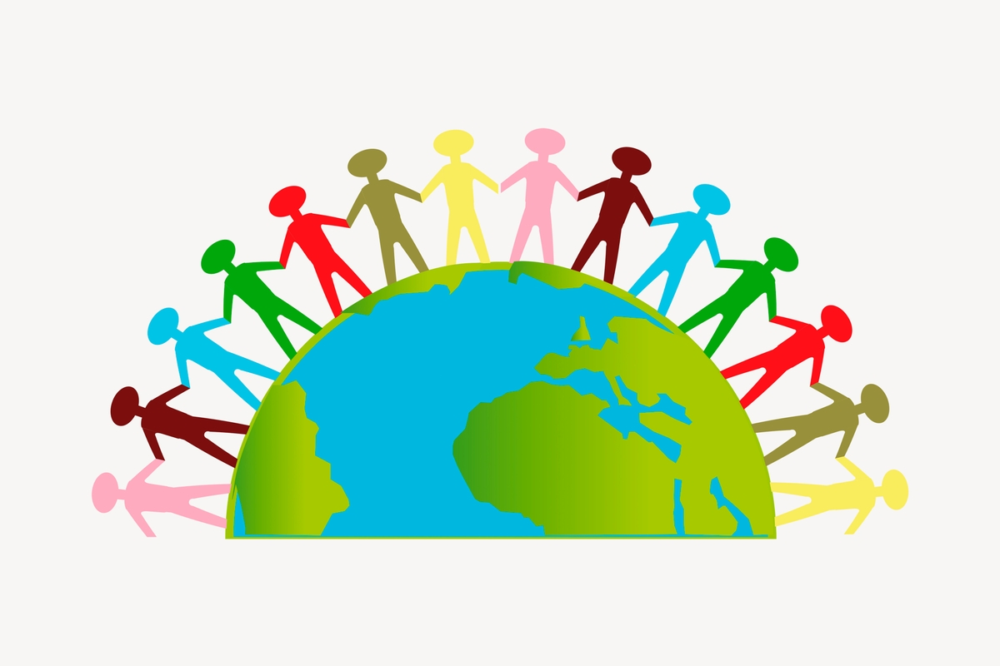
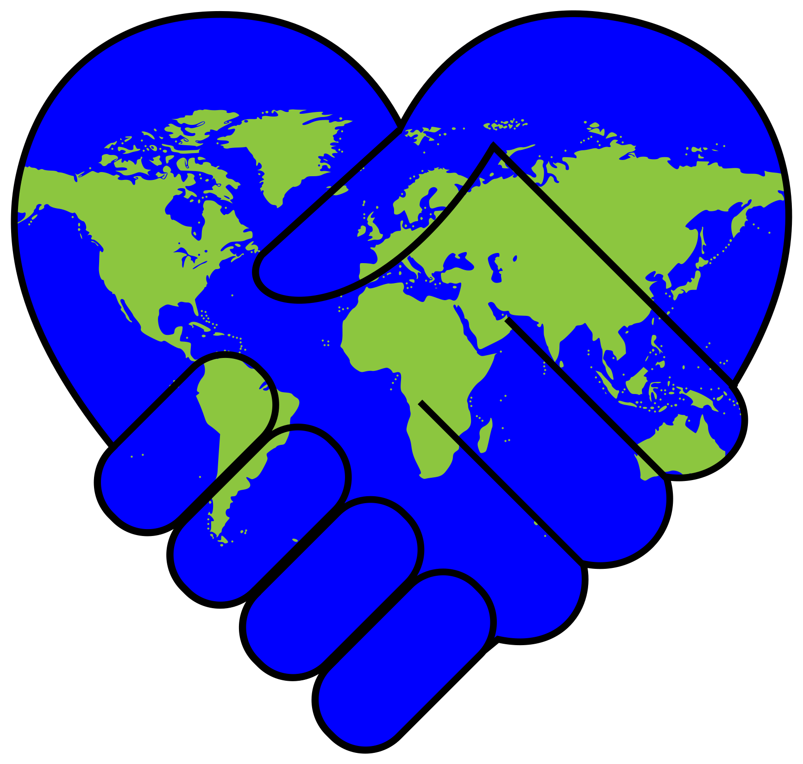

# My Little Pony
<!DOCTYPE html >
<html >
<body>
<h2 > Introduction </h2>

 The importance of My Little Pony to society has been ignored long enough. It is time for people to understand the gravity of how much My Little Pony has shaped us as humans. It is also essential to express the urgency of more people watching My Little Pony. **Please note that I only support the My Little Pony: Friendship is Magic series. I do not support or condone the atrociousness of the new releases.** 

<h2 > What is it? </h2>

 My Little Pony is a media franchise developed by an American toy company, Hasbro, and created by Bonnie Zacherle. The most amazing part of My Little Pony is its famous series My Little Pony: Friendship is Magic. The series ran for nine seasons from October 2010 to October 2019. Unfortunately, new animated series like My Little Pony: Pony Life and My Little Pony: Make Your Mark have been released. None come close to the original and Hasbro should be ashamed of the new animation style. 

<h2 > What are the benefits? </h2>

 The benefits of My Little Pony: Friendship is Magic are immeasureable. Not only is it a beautifully made series with both an amazing plot and amazing characters, but it also offers important life lessons. It teaches important social skills and has positive role models. Emotional intelligence can be expanded and lessons of teamwork are emphasized. The show also has strong themes of facing challanges and preserverance. This can help during both school and work. Not to mention, My Little Pony is extremeley helpful for ones mental health. I personally watch My Little Pony during stressful times such as before tests or during AP season.  

<h2> Who can watch it and why is it important? </h2>

 Everyone and anyone can watch My Little Pony. While the target audience tends to be children, I think more adults should watch the show. Most children are pure souls with kindness and empathy. The same cannot be said for adults. Adults, who have undergone unspeakable traumas such as paying taxes, no longer have a light in their eyes. Their years of pain and misery have taken its toll on their character. This is why they need to watch My Little Pony. Have you ever met anyone who doesn't understand basic decency? Someone who is incapable of smiling? Someone who lies unnecessarily or would stab you in the back for five dollars? Someone who wouldn't give you a dollar if you were one short from life saving medication. This is why we need My Little Pony. My Little Pony teaches about the six Elements of Harmony: honesty, kindness, laughter, generosity, loyalty, and magic. All things that adults are lacking. If more people watched My Little Pony, then the world would be a better place. Crime wouldn't exist because Twilight Sparkle wouldn't like that. No one would ever be sad because Pinkie Pie is never sad. All of the world's problems would be solved. People would understand that all this war and inequality shouldn't be happening. Instead, we should all just hold hands and be friends. 

   
  Quiz time!!! </h2>

 [Which My Little Pony Character am I!](https://www.proprofs.com/quiz-school/story.php?title=which-mlpfim-background-pony-are-you) 

</body>
</html>
